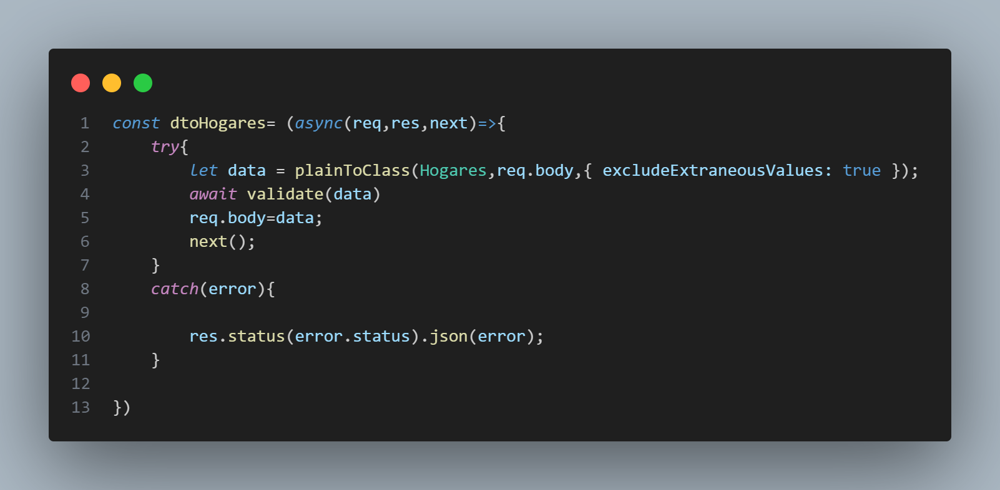
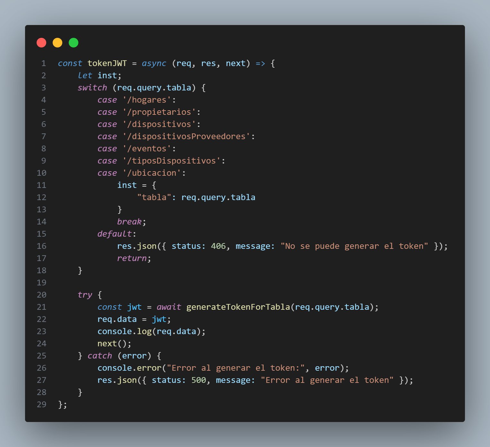
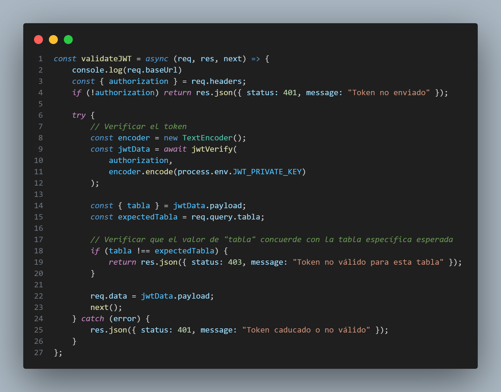
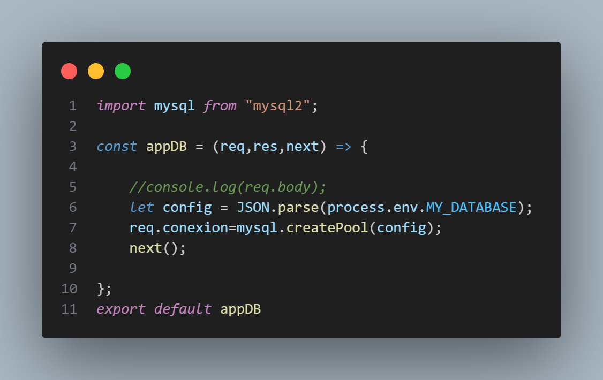

# Plataforma de intercambio de datos de IoT

Facilita el intercambio seguro y eficiente de datos generados por dispositivos de Internet de las cosas (IoT), permitiendo la integración de múltiples fuentes de datos, análisis en tiempo real y aplicaciones de aprendizaje automático. Se utilizan bases de datos para almacenar y gestionar los datos provenientes de los dispositivos IoT.


## Objetivo General
 Desarrollar un sistema de gestión de dispositivos IoT utilizando Node.js y Express, que permita la creación y administración de una base de datos para almacenar y gestionar los datos generados por los dispositivos IoT.

### Descripción

El objetivo principal de este proyecto es crear un sistema que facilite la gestión de dispositivos IoT y los datos que generan. Se utilizará Node.js y Express como tecnologías principales para el desarrollo del servidor y la API que interactuará con la base de datos.

El sistema permitirá la creación de nuevos dispositivos IoT, con la posibilidad de asignarles propiedades específicas como nombre, ubicación y tipo de dispositivo. Además, se implementarán funcionalidades para registrar y almacenar los datos generados por los dispositivos, como lecturas de sensores, eventos y cualquier otra información relevante.


## Objetivos especificos
1. Crear las tablas y relaciones de la base de datos: Definir y crear las tablas necesarias en la base de datos para almacenar la información de los dispositivos IoT, los datos generados por ellos y cualquier otra entidad relevante.

2. Implementar la API para la gestión de dispositivos: Desarrollar las rutas y controladores necesarios para permitir la creación, actualización, lectura y eliminación de dispositivos IoT a través de la API.

3. Configurar la autenticación y autorización: Implementar un sistema de autenticación y autorización para proteger el acceso a la API y asegurar que solo los usuarios autorizados puedan realizar operaciones en la base de datos.

4. Crear una interfaz de usuario para la gestión de dispositivos: Desarrollar una interfaz de usuario que permita a los usuarios crear, editar y eliminar dispositivos IoT, así como visualizar información relacionada con ellos, como el estado, la ubicación y otros atributos relevantes.

6. Documentar el sistema: Crear documentación clara y detallada sobre la arquitectura del sistema, las API disponibles, los flujos de trabajo y cualquier otra información relevante que facilite el mantenimiento y la comprensión del sistema por parte de otros desarrolladores.

## Alcance
Desarrollo del servidor: Implementar un servidor utilizando Node.js y Express para manejar las solicitudes HTTP y proporcionar una API que permita la interacción con la base de datos.

Diseño de la base de datos: Crear el esquema de la base de datos que almacenará la información de los dispositivos IoT y los datos generados por ellos. Definir las tablas, relaciones y restricciones necesarias para asegurar la integridad de los datos.

Creación de la API: Diseñar y desarrollar una API RESTful que permita la creación, actualización, lectura y eliminación de dispositivos, así como el registro y consulta de los datos generados por ellos.

Autenticación y autorización: Implementar un sistema de autenticación y autorización para proteger los datos y limitar el acceso a las funciones y recursos del sistema.

Interfaz de usuario: Desarrollar una interfaz de usuario intuitiva y fácil de usar para que los usuarios puedan interactuar con el sistema. Esto incluye la implementación de una página web.

Gestión de dispositivos: Permitir la creación, edición y eliminación de dispositivos IoT en la base de datos. Esto puede incluir la especificación de propiedades como el nombre del dispositivo, ubicación, tipo de dispositivo, etc.

Registro de datos: Implementar la funcionalidad para registrar y almacenar los datos generados por los dispositivos IoT en la base de datos. Esto puede incluir la captura de lecturas de sensores, eventos, estados y cualquier otra información relevante.

Consultas y análisis de datos: Proporcionar funcionalidades de consulta y análisis de datos para que los usuarios puedan obtener información en tiempo real, sobre los datos almacenados en la base de datos.


## Entregables y Avances
(**Lunes 17 Julio -> Avance**): Creación del diagrama de la base de datos que se utilizará para la gestión de dispositivos IoT, con sus respectivas tablas, relaciones y restricciones.


(**Jueves 27 Julio -> Avance**):Desarrollo una API que permita la creación, actualización, lectura y eliminación de dispositivos, así como el registro y consulta de los datos generados por ellos.
## Installation

Este es un servidor Express que proporciona diferentes rutas para acceder y administrar recursos relacionados con un sistema de hogares inteligentes. El servidor implementa la autenticación basada en tokens JSON Web Token (JWT) para proteger las rutas y garantizar que solo los usuarios autorizados puedan acceder a los recursos, utiliza MySQL como base de datos.

Requisitos:
1. Node.js instalado en el sistema.
2. Base de datos u otros servicios necesarios para la funcionalidad completa del servidor.
3. Archivo .env configurado con las variables de entorno necesarias para el servidor.

4. Clonar este repositorio en tu máquina local.
```bash
 git clone https://github.com/gersonhdz8/Plataforma-de-intercambio-de-datos-de-IoT.git
```

5. Navegar al directorio del proyecto
6. Instalar las dependencias
```bash
 npm install express typescript class-transformer class-validator dotenv jose mysql2 reflect-metadata

```
7. Configurar el archivo .env con las variables de entorno necesarias. Asegúrate de proporcionar las configuraciones adecuadas para el servidor y la base de datos.

8. Ejecuta los comandos de SQL para crear la base de datos e insertar los datos por defecto en la carpeta DataBase

8. Para iniciar el servidor, utiliza el siguiente comando:
```bash
 npm run dev

```
El servidor se ejecutará en el puerto y la dirección configurados en el archivo .env y mostrará un mensaje en la consola indicando la dirección en la que está funcionando.


    
## Rutas

El servidor proporciona las siguientes rutas para acceder y administrar los recursos:

"**/token**": Ruta para obtener un token JWT válido.

"**/hogares**": Ruta para acceder a los hogares registrados.

"**/propietarios**": Ruta para acceder a los propietarios de los hogares.

"**/dispositivos**": Ruta para acceder a los dispositivos asociados a los hogares.

"**/ubicacion**": Ruta para acceder a la ubicación de los hogares.

"**/tiposDispositivos**": Ruta para acceder a los tipos de dispositivos disponibles.

"**/proveedores**": Ruta para acceder a los proveedores de dispositivos.

"**/eventos**": Ruta para acceder a los eventos registrados.

"**/dispositivosProveedores**": Ruta para acceder a la información de dispositivos proporcionados por proveedores.
## Autenticación
El servidor utiliza la autenticación basada en tokens JSON Web Token (JWT) para proteger las rutas y asegurar que solo los usuarios autorizados puedan acceder a los recursos. Para acceder a las rutas protegidas, incluye el token JWT en el encabezado Authorization de tus solicitudes
## Middleware DTO

Cada función middleware en el archivo dto.js sigue una estructura similar:

1. Se importan las clases de controladores correspondientes y las bibliotecas class-transformer y class-validator.

2. La función middleware se declara como una función asíncrona, ya que la transformación y validación pueden requerir operaciones asíncronas.

3. Se utiliza plainToClass de class-transformer para convertir los datos en objetos de clase según las reglas definidas en las clases de controladores correspondientes.

4. Se utiliza validate de class-validator para validar los datos transformados según las reglas definidas en las clases de controladores.

5. Si los datos no cumplen con las reglas de validación, se devuelve una respuesta de error con el código de estado y los mensajes de error correspondientes.

6. Si los datos son válidos, se pasa al siguiente middleware o al controlador según corresponda.



El DTO se utiliza para transformar los datos recibidos en las solicitudes al formato deseado del modelo Hogares. Esto se logra mediante la función plainToClass proporcionada por class-transformer. La función plainToClass toma los datos en formato JSON recibidos en la solicitud y los convierte en una instancia del modelo Hogares, aplicando las transformaciones definidas en los decoradores del modelo.

El modelo Hogares contiene las siguientes propiedades:

ID_hogar: Número entero que representa el ID único del hogar.

Nombre_hogar: Cadena de texto que representa el nombre del hogar.

Direccion: Cadena de texto que representa la dirección del hogar.

Ciudad: Cadena de texto que representa la ciudad del hogar.

Pais: Cadena de texto que representa el país del hogar.

ID_propietario: Número entero que representa el ID único del propietario del hogar.

Cada propiedad del modelo Hogares está anotada con decoradores de validación (@IsString, @IsNumber, @IsDefined, @IsNotEmpty, etc.). Estos decoradores definen reglas para validar los datos que se proporcionan para cada propiedad.

Por ejemplo, @IsString se utiliza para verificar que el valor de la propiedad sea una cadena de texto, y @IsDefined se utiliza para verificar que la propiedad no sea undefined.

## Middleware JWT

El servidor utiliza dos funciones middleware para generar y validar tokens JWT:

tokenJWT: Esta función middleware genera un token JWT válido para una tabla específica. Verifica el parámetro tabla en la consulta de la solicitud y genera un token para esa tabla. Si la tabla no es válida, devuelve un mensaje de error.



validateJWT: Esta función middleware verifica la validez del token JWT proporcionado en el encabezado Authorization. También verifica que el valor de la tabla en el token concuerde con la tabla específica esperada para la ruta actual. Si el token no es válido o no coincide con la tabla esperada, devuelve un mensaje de error.




##  Middleware appDB
El middleware appDB es una función que se utiliza para establecer una conexión de base de datos a MySQL antes de que las solicitudes sean manejadas por el servidor. Este middleware utiliza la biblioteca mysql2 para crear y administrar la conexión con la base de datos.


### Funcionamiento
El middleware appDB se encarga de crear una conexión de base de datos utilizando los parámetros de configuración proporcionados en las variables de entorno. La conexión se crea mediante la función mysql.createPool() de la biblioteca mysql2. Luego, la conexión se asigna al objeto req.conexion para que esté disponible en las rutas y controladores posteriores.

Una vez que la conexión ha sido establecida, el middleware pasa la solicitud al siguiente middleware en la cadena utilizando next().

Es importante tener en cuenta que mysql2 crea una conexión en forma de grupo (pool) que gestiona las conexiones de manera eficiente, permitiendo reutilizarlas en lugar de crear y cerrar una nueva conexión cada vez que se necesita acceder a la base de datos.

### Importante
Asegúrate de que la configuración de la base de datos en las variables de entorno sea correcta y que los valores de host, usuario, contraseña y nombre de la base de datos sean válidos y correspondan a tu entorno de desarrollo.

Recuerda también cerrar la conexión de la base de datos adecuadamente cuando ya no sea necesaria, especialmente al finalizar la ejecución del servidor o al finalizar las solicitudes que requieran acceso a la base de datos.
## EndPoints

**Generar Token JWT**
- Método: GET
- Ruta: /token
- Parámetros de consulta:
    - tabla: (String) El nombre de la tabla para la que se generará el token.

Este endpoint permite generar un token JWT válido para una tabla específica. Se debe proporcionar el nombre de la tabla en el parámetro de consulta tabla. El token generado será válido por 30 minutos y se utilizará para acceder a rutas protegidas relacionadas con esa tabla.

**(Las rutas son iguales para el resto de tablas, sólo hay que cambiar el nombre de la tabla "/dispositivos/list", "dispositivos/post", etc)**
**Para cada ruta cambia el cuerpo de la solicitud a recibir. Los ejemplos se encuentran en el archivo formatoData.txt**

**Listar**
- Método: GET
- Ruta: /hogares/list
Este endpoint permite obtener una lista de todos los hogares registrados en el sistema.

**Crear**
- Método: POST
- Ruta: /hogares/post
- Cuerpo de la solicitud: Objeto JSON que representa los datos del hogar.
    - Nombre_hogar: (String) El nombre del hogar.
    - Direccion: (String) La dirección del hogar.
    - Ciudad: (String) La ciudad del hogar.
    - Pais: (String) El país del hogar.
    - ID_propietario: (Number) El ID del propietario del hogar.
Este endpoint permite crear un nuevo hogar en el sistema. Se deben proporcionar todos los datos requeridos en el cuerpo de la solicitud en formato JSON.

**Actualizar**
- Método: PUT
- Ruta: /hogares/update/:ID_hogar
- Parámetros de la ruta:
    - ID_hogar: (Number) El ID del hogar que se desea actualizar.
- Cuerpo de la solicitud: Objeto JSON que representa los datos actualizados del hogar. Se pueden proporcionar uno o varios campos para actualizar.
    - Nombre_hogar: (String) El nuevo nombre del hogar.
    - Direccion: (String) La nueva dirección del hogar.
    - Ciudad: (String) La nueva ciudad del hogar.
    - Pais: (String) El nuevo país del hogar.
    - ID_propietario: (Number) El nuevo ID del propietario del hogar.
Este endpoint permite actualizar un hogar existente en el sistema. Se debe proporcionar el ID del hogar en la ruta y los datos actualizados en el cuerpo de la solicitud en formato JSON.

**Eliminar**
- Método: DELETE
- Ruta: /hogares/delete/:ID_hogar
- Parámetros de la ruta:
    - ID_hogar: (Number) El ID del hogar que se desea eliminar.
Este endpoint permite eliminar un hogar existente en el sistema. Se debe proporcionar el ID del hogar en la ruta.
## Authors

- [@Gerson Hernández](https://github.com/gersonhdz8)

